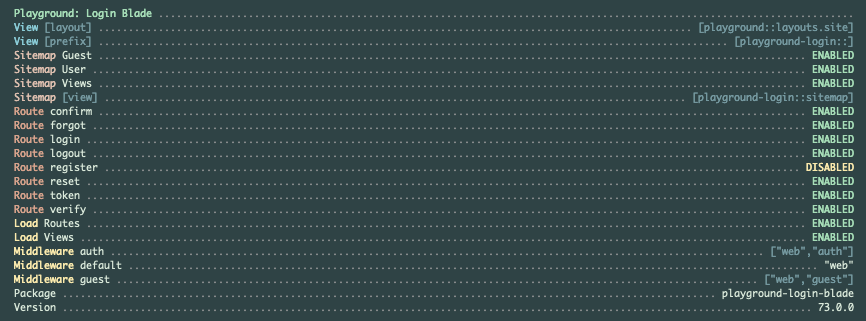

# Playground Login Blade

[](https://raw.githubusercontent.com/gammamatrix/playground-login-blade/testing/develop/testdox.txt)
[](tests)
[](.github/workflows/ci.yml#L120)

The Playground Login Blade package for [Laravel](https://laravel.com/docs/11.x) applications.

This package provides Authentication Controllers and Blade UI handling:
- Email Address Verification
- Password Management
- Authentication Supporting Roles, Privileges or Sanctum
- User Registration
- Supports logging out all devices with Sanctum.
- Provides API Tokens via Sanctum.

Read more on using Playground Login Blade [at the Read the Docs for Playground.](https://gammamatrix-playground.readthedocs.io/)

## Installation

You can install the package via composer:

```bash
composer require gammamatrix/playground-login-blade
```

## `artisan about`

Playground Login Blade provides configurationinformation in the `artisan about` command.



## Configuration

If you need to customize the configuration, you can publish the config file with:
```bash
php artisan vendor:publish --provider="Playground\Login\Blade\ServiceProvider" --tag="playground-config"
```

See the contents of the published config file: [config/playground-login-blade.php](config/playground-login-blade.php)

You can publish the views file with:
```bash
php artisan vendor:publish --provider="Playground\Login\Blade\ServiceProvider" --tag="playground-view"
```

### User Model

Playground tries to support as many auth handling methods as possible.

Currently, the following contracts are used for various package features.

#### `Illuminate\Contracts\Auth\MustVerifyEmail`

See the [Email Verification Controller](src/Http/Controllers/EmailVerificationController.php)
- [routes for email verification](routes/verify.php)
- Middleware configuration: `config('playground-login-blade.middleware.auth')`

#### `Illuminate\Contracts\Auth\Authenticatable`

#### `Laravel\Sanctum\Contracts\HasApiTokens`

#### `Playground\Models\Contracts\Abilities`

```php
public function addAbility(mixed $ability): void;

public function hasAbility(mixed $ability): bool;

public function removeAbility(mixed $ability): void;
```

Abilities may be used with Sanctum. Abilities are included in `Playground\Models\User` with the trait:
- [playground - src/Models/Traits/Abilities.php](https://github.com/gammamatrix/playground/blob/develop/src/Models/Concerns/Abilities.php)


#### `Playground\Models\Contracts\Admin`

```php
public function isAdmin(): bool;
```

#### `Playground\Models\Contracts\Privileges`

```php
public function addPrivilege(mixed $privilege): void;

public function hasPrivilege(mixed $privilege): bool;

public function removePrivilege(mixed $privilege): void;
```

#### `Playground\Models\Contracts\Role`

```php
public function addRole(mixed $role): void;

public function hasRole(mixed $role): bool;

public function removeRole(mixed $role): void;
```
- **TODO** Move this info to the wikis.


### Environment Variables

#### Loading

| env()                                | config()                             |
|--------------------------------------|--------------------------------------|
| `PLAYGROUND_LOGIN_BLADE_LOAD_VIEWS`  | `playground-login-blade.load.views`  |
| `PLAYGROUND_LOGIN_BLADE_LOAD_ROUTES` | `playground-login-blade.load.routes` |
- `PLAYGROUND_LOGIN_BLADE_LOAD_ROUTES` must be enabled to load the routes in the application (unless published to your app - the control for this is in the [ServiceProvider.php](src/ServiceProvider.php))

#### Routes

All routes are disabled by default in the base Playground package.

| env()                                    | config()                                 |
|------------------------------------------|------------------------------------------|
| `PLAYGROUND_LOGIN_BLADE_ROUTES_CONFIRM`  | `playground-login-blade.routes.confirm`  |
| `PLAYGROUND_LOGIN_BLADE_ROUTES_FORGOT`   | `playground-login-blade.routes.forgot`   |
| `PLAYGROUND_LOGIN_BLADE_ROUTES_LOGIN`    | `playground-login-blade.routes.login`    |
| `PLAYGROUND_LOGIN_BLADE_ROUTES_LOGOUT`   | `playground-login-blade.routes.logout`   |
| `PLAYGROUND_LOGIN_BLADE_ROUTES_REGISTER` | `playground-login-blade.routes.register` |
| `PLAYGROUND_LOGIN_BLADE_ROUTES_RESET`    | `playground-login-blade.routes.reset`    |
| `PLAYGROUND_LOGIN_BLADE_ROUTES_TOKEN`    | `playground-login-blade.routes.token`    |
| `PLAYGROUND_LOGIN_BLADE_ROUTES_VERIFY`   | `playground-login-blade.routes.verify`   |


#### Middleware

The middleware values can be customized. See the default values on the command line with: `artisan about`

| env()                                       | config()                                |
|---------------------------------------------|-----------------------------------------|
| `PLAYGROUND_LOGIN_BLADE_MIDDLEWARE_AUTH`    | `playground-login-blade.routes.auth`    |
| `PLAYGROUND_LOGIN_BLADE_MIDDLEWARE_DEFAULT` | `playground-login-blade.routes.default` |
| `PLAYGROUND_LOGIN_BLADE_MIDDLEWARE_GUEST`   | `playground-login-blade.routes.guest`   |

#### Sessions

By default, authentication tokens will be saved in the session. Sessions use the Laravel `web` middleware.

| env()                            | config()                                |
|----------------------------------|-----------------------------------------|
| `PLAYGROUND_LOGIN_BLADE_SESSION` | `playground-login-blade.routes.session` |

#### Sitemap

This package provides support for displaying a website map with the [Playground Site Blade](https://github.com/gammamatrix/playground-site-blade) package.

| env()                                   | config()                               |
|-----------------------------------------|----------------------------------------|
| `PLAYGROUND_LOGIN_BLADE_SITEMAP_ENABLE` | `playground-login-blade.sitemap.enable`|
| `PLAYGROUND_LOGIN_BLADE_SITEMAP_GUEST`  | `playground-login-blade.sitemap.guest` |
| `PLAYGROUND_LOGIN_BLADE_SITEMAP_USER`   | `playground-login-blade.sitemap.user`  |
| `PLAYGROUND_LOGIN_BLADE_SITEMAP_VIEW`   | `playground-login-blade.sitemap.view`  |

#### UI

If `PLAYGROUND_LOGIN_BLADE_LAYOUT` is not set, it defaults to `PLAYGROUND_BLADE_LAYOUT` from the base [Playground Blade](https://github.com/gammamatrix/playground-blade) package.

| env()                           | config()                        |
|---------------------------------|---------------------------------|
| `PLAYGROUND_LOGIN_BLADE_LAYOUT` | `playground-login-blade.layout` |
| `PLAYGROUND_LOGIN_BLADE_VIEW`   | `playground-login-blade.view`   |

## Testing

```sh
composer test
```

## Changelog

Please see [CHANGELOG](CHANGELOG.md) for more information on what has changed recently.

## Credits

- [Jeremy Postlethwaite](https://github.com/gammamatrix)

## License

The MIT License (MIT). Please see [License File](LICENSE.md) for more information.
